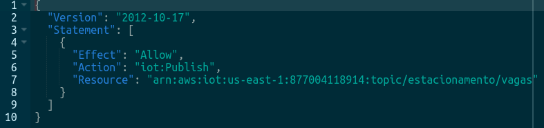
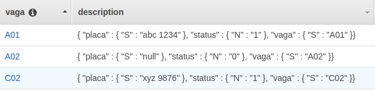

# Estacionamento Inteligente
  Um dos principais problemas de centros urbanos é o elevado número de carros particulares, isso causa ao motorista uma grande dificuldade em encontrar vagas de estacionamento mesmo em locais privados. Por isso, o objetivo deste projeto é propor uma solução que facilite a localização de vagas em estacionamentos privados, utilizando o conceito de Internet das Coisas (IoT),  onde o condutor será capaz de localizar uma vaga por meio de um aplicativo. 

1. [Arquitetura](#arquitetura)
2. [Camada de percepção](#camada-de-percepção)     
        1. [MQTT](#mqtt)   
        2. [AWS IoT Core](#aws-iot-core)   
3. [Camada de processamento](#camada-de-processamento)
4. [Camada de aplicação](#camada-de-aplicação)   
        1. [Identificação de usuários](#identificação-de-usuários)
5. [Referências](#referências)
## Arquitetura

  Para desenvolver esse projeto, foi escolhido a arquitetura de cinco camadas, que atualmente é um dos modelos mais utilizados na área de IoT (MASHAL et al., 2015). Essa estrutura é composta pelas camadas:
* Percepção: também chamada de camada de dispositivo, é responsável pela identificação de objetos e aquisição de dados.
* Rede: sua função é estabelecer a comunicação entre a camada de percepção com a camada de processamento de forma segura e confiável.
* Processamento: encarregada de armazenar, analisar e processar as informações já obtidas.
* Aplicação: permite a interação entre o usuário e a camada de dispositivo.
* Negócio: essa camada é responsável por gerir os serviços implementados e com os dados recebidos da camada de aplicação construir um modelo de negócios.

  Tendo em vista essa arquitetura aplicada ao projeto, a camada de percepção terá como sensor uma câmera, dessa forma será possível decidir se a vaga está disponível ou qual o carro que está a ocupando. Para conexão entre a camada de dispositivo e de processamento, haverá um microcontrolador para adquirir os dados desse sensor e enviá-los via o protocolo MQTT para essa camada. Com esses dados, a camada de processamento será encarregada de armazenar e disponibilizar as informação para a camada da aplicação de interface com o usuário, a figura 1 mostra o diagrama do sistema.

 Figura 1 - Arquitetura do Projeto

  

## Camada de percepção

A camada de rede é responsável pela conexão entre o sensor e a camada de gerenciamento de informações, então, essa camada precisa oferecer um serviço confiável de transmissão de dados.  Para isso, o protocolo de comunicação escolhido foi o MQTT junto com o microcontrolador ESP32 para o envio de dados para o servidor da AWS, o IoT Core.

### MQTT 
O MQTT (*Message Queue Telemetry Transport*) é um protocolo leve que utiliza baixa largura de rede, baseado em TCP/IP. Utiliza o paradigma de publicação e assinatura (*publish/Subscribe*) em um tópico de um servidor para gerenciar o fluxo de dados. 

Nesse padrão, quando um cliente deseja receber uma determinada informação, ele se subscreve em um tópico por meio de uma requisição para um servidor (também conhecido como *broker*), que oferece o serviço de intermediador nesse processo. Serviços que desejam enviar os dados também devem se inscrever nesse tópico. (YUAN, 2017).

### AWS IoT Core 

O AWS IoT Core é um serviço de nuvem gerenciada que permite a conexão fácil e segura de dispositivos e aplicativos à Internet. Para estabelecer a segurança no envio e recebimento de mensagens, este serviço oferece autenticação e criptografia mútua nos pontos de conexão, dessa forma, dispositivos e o Core não trocam mensagem sem uma identidade comprovada. 

Os dispositivos que comunicam-se com o protocolo MQTT utilizam o método de segurança baseado em certificado, que usa o protocolo TLS. Assim, quando um dispositivo tenta se conectar a plataforma, o AWS IoT Core solicita um certificado de cliente e valida o status do certificado, em seguida, solicita a chave privada que corresponde a chave publica que está no certificado.
	
Para haver transferência de dados, além de possuir o certificado, o dispositivo (também chamado de coisa) também precisa estar autorizado a promover a leitura ou escrita em um tópico. Por isso é preciso configurar as politicas de acesso a ‘coisa’, dessa maneira, o usuário tem pleno controle dos acessos aos tópicos do Core.

No projeto, o envio de dados é feito apenas pelo microcontrolador, então foi preciso criar uma coisa (*thing*) que represente este dispositivo na plataforma. Em seguida, criou-se um certificado de autenticação e associar a coisa. Por fim, a politica de autorização foi criada (figura 2), que nesse caso apenas de publicação no tópico da aplicação.

 Figura 2 - Política de dispositivos conectados 

  

 ## Camada de processamento
 
 Para armazenar os dados obtidos dos sensores, foi utilizado a plataforma de banco de dados da Amazon, o DynamoDB. Essa tecnologia é um serviço de banco de dados NoSQL (não relacional), com o tipo de armazenamento de chave-valor.

Os componentes do DynamoDB podem ser divididos em três: tabelas, itens e atributos. As tabelas são referentes a todos dados armazenados, os itens são os grupos de atributos que possuem identificação própria, e os atributos são elementos de dados fundamentais aos itens.

Ao criar uma nova tabela, além de seu nome é preciso especificar a chave primária, ou seja um identificador exclusivo para cada item. Isso pode ser feito de duas formas, com a chave de partição utilizado quando existe apenas uma chave primária, ou a chave primária composta, para quando há múltiplos itens com a mesma chave. 

A chave de partição é composta por apenas um atributo e a utiliza para a chamada da função hash. Já a chave primária composta, contém a chave de partição, que também chama a função hash, e a chave de classificação arranja os dados com a mesma chave primária de forma ordenada.

Para associar a camada de rede com a camada de processamento, foi estabelecido uma regra no AWS IoT Core que ao receber uma mensagem no tópico do estacionamento a informação era salva no banco de dados “Estacionamento”. 

A tabela criada para esse projeto foi estabelecida com a chave de partição, sendo a chave primária o número da vaga, e com os atributos de status, para verificar se a vaga está ocupada e número da placa do carro. Quando não houver carro na vaga, este ultimo atributo estará como nulo, a figura 3 mostra uma pré-visualização da tabela.
 

 Figura 3 - Tabela do banco de dados 

  

 ## Camada de aplicação
 
 A comunicação entre os dados adquiridos e o usuário final foi realizada por meio de um aplicativo, utilizando o framework Amplify, disponibilizado pela Amazon. Essa ferramenta oferece diversas bibliotecas que facilitam a integração do backend ao frontend da aplicação.
 
 ### Identificação de usuários
 
 Para o gerenciamento de usuários no aplicativo, foi utilizado o recurso Amazon Cognito. Essa ferramenta permite adicionar cadastros, efetuar login e controle de acesso de usuários, além de permitir a autenticação por meio de provedores de identidade sociais, tal como Google, Facebook e a Amazon.
 
 ## Referências

AMAZON. Amazon Cognito: developer guide. Disponível em: https://docs.aws.amazon.com/cognito/latest/developerguide/cognito-dg.pdf. Acesso em: 06 abr. 2020.

AMAZON. Amazon DynamoDB: developer guide. Disponível em: https://docs.aws.amazon.com/amazondynamodb/latest/developerguide/dynamodb-dg.pdf. Acesso em: 06 abr. 2020.

AMAZON. AWS IoT: developer guide. Disponível em: https://docs.aws.amazon.com/iot/latest/developerguide/iot-dg.pdf. Acesso em: 06 abr. 2020.

MASHAL, Ibrahim et al. Choices for interaction with things on Internet and underlying issues. Ad Hoc Networks. Online, p. 68-90. maio 2015. Disponível em: https://www.sciencedirect.com/science/article/abs/pii/S1570870514003138?via%3Dihub. Acesso em: 03 abr. 2020.
	
YUAN, Michael. Conhecendo o MQTT: por que o mqtt é um dos melhores protocolos de rede para a internet das coisas?. Por que o MQTT é um dos melhores protocolos de rede para a Internet das Coisas?. 2017. Disponível em: https://www.ibm.com/developerworks/br/library/iot-mqtt-why-good-for-iot/index.html. Acesso em: 03 abr. 2020.
	
